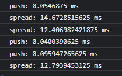

# spread/push in reduce

this is just a test to represent the difference in performance between `spread` and `push` inside `reduce`

on my machine machine `push` works ~400 times faster than `...`:

